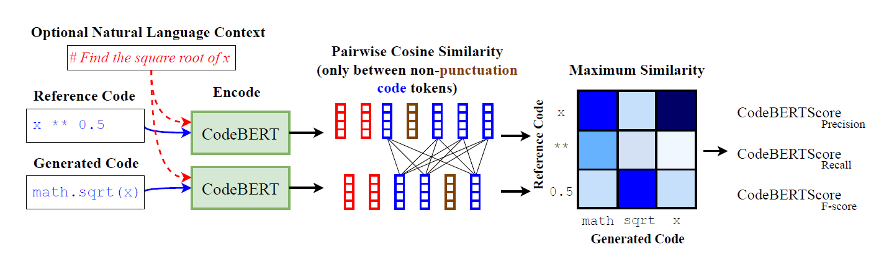

# CodeBERTScore

CodeBERTScore is an Automatic Evaluation Metric for Code. It computes a soft similarity score between each token in the generated code and in the reference code, using the contextual encodings of large pretrained models.

It supports five code languages: **Java, Python, C, C++, and JavaScript**.

Below is a diagram illustration of CodeBERTScore:


**Highlight** - CodeBERTScore can compute the similarity between the Python expressions `x ** 0.5` and `math.sqrt(x)`, which are functionally equivalent, even though they have very few overlapping tokens.

_**April 2023**_ - CodeBERTScore is now available on [pypi](https://pypi.org/project/code-bert-score/), which means that you can simply `pip install code-bert-score`!


## Usage
```
import code_bert_score
pred_results = code_bert_score.score(cands=predictions, refs=refs, lang='python')
```
Where `pred_results` is a 4-tuple of `(precision, recall, F1, F3)`, where each is a 1-D tensor of scores for each prediction-reference pair. `F3` is similar to the well-known `F1` score, that considers recall 3 times as important as precision. 


## Huggingface 🤗 Models
We fine-tuned the `microsoft/codebert-base-mlm` model for 1,000,000 steps (with `batch_size=32`) on several languages separately.

We released the following models to the Huggingface hub:
* `neulab/codebert-python` (the default model for `lang='python'`)
* `neulab/codebert-javascript` (the default model for `lang='javascript'` or `'js'`)
* `neulab/codebert-c` (the default model for `lang='c'`)
* `neulab/codebert-cpp` (the default model for `lang='cpp'` or `'c++'`)
* `neulab/codebert-java` (the default model for `lang='java'`)

The appropriate model will be loaded automatically when passing the `lang` argument to the `score(..)` function, for example: `lang='python'`. 
For other uses, these models can be loaded using (for example):
```python
from transformers import AutoTokenizer, AutoModelForMaskedLM

tokenizer = AutoTokenizer.from_pretrained("neulab/codebert-python")
model = AutoModelForMaskedLM.from_pretrained("neulab/codebert-python")
```


## Citation
```
@article{zhou2023codebertscore,
  url = {https://arxiv.org/abs/2302.05527},
  author = {Zhou, Shuyan and Alon, Uri and Agarwal, Sumit and Neubig, Graham},
  title = {CodeBERTScore: Evaluating Code Generation with Pretrained Models of Code},  
  publisher = {arXiv},
  year = {2023},
}
```
